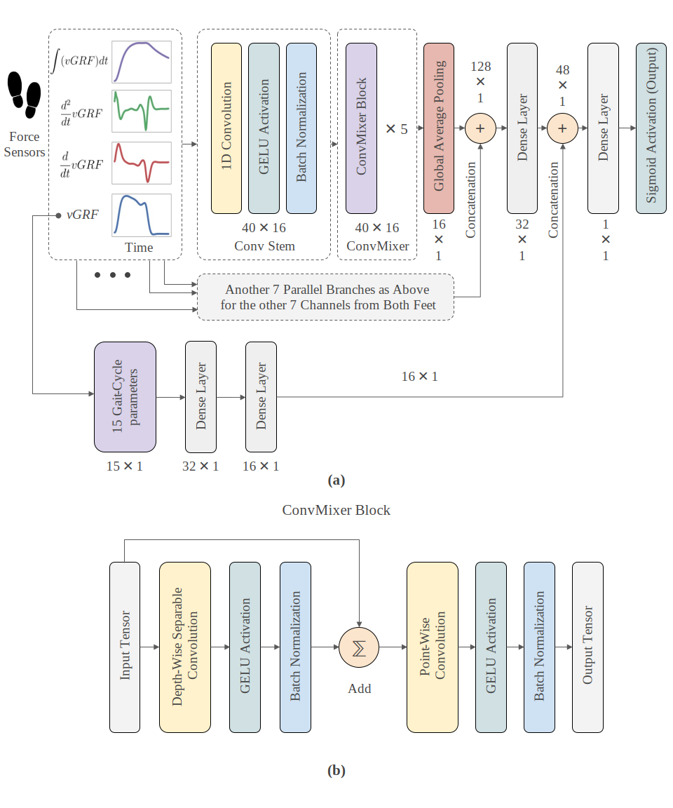

<h1 align="center">
NDDNet
<p>

</p>
</h1>
<h3 align="center">A Deep Learning Model for Predicting Neurodegenerative Diseases from Gait Pattern</h3>

<p align="center">
    <a href="https://github.com/atick-faisal/NDDNet/releases"></a>
    <a href="https://github.com/atick-faisal/NDDNet/issues"></a>
    <a href="https://github.com/atick-faisal/NDDNet/contributors"></a>
</p>

<p align="center">
  
</p>


### Implementation of the NDDNet Architecture
The TensorFlow implementation of the architecture can be found [here](src/models/model.py).
<p align="center">
  
  Figure: The proposed network architecture. The network is composed of two parallel parts for processing the vGRF signals and the gait-cycle parameters. (a) The entire network architecture. (b) The ConvMixer block architecture.
</p>


### Dependencies
```
  numpy
  pandas
  scikit-learn
  tensorflow
  wfdb
  tsfel
  rich
```

### Dataset
The dataset used in this work can be found on [PhysioNet](https://physionet.org/content/gaitndd/1.0.0/). Its also available in the `data/gaitndd` directory.


### How to Use
1. Install the dependencies
2. Run `src/Inference.py` for doing the inference on the dataset
3. Run `src/train.py` to train the model


### Pre-trained Weights
Pretrained weights are available in the `weights` directory. The weights were generated by a (Leave-One-Out-Cross-Validation) LOOCV method.

### Cite This Work
```
Faisal, M.A.A., Chowdhury, M.E.H., Mahbub, Z.B. et al. 
NDDNet: a deep learning model for predicting neurodegenerative diseases from gait pattern. 
Appl Intell (2023). https://doi.org/10.1007/s10489-023-04557-w
```

<p align="center"></p>
<p align="center"><a href="https://sites.google.com/view/mchowdhury" target="_blank">Qatar University Machine Learning Group</a>
<p align="center"><a href="https://github.com/catppuccin/catppuccin/blob/main/LICENSE"></a></p>
